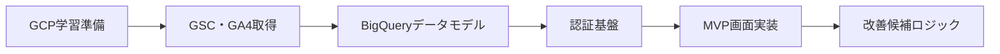

# TASKS.md

## Project status
- Phase: MVP
- Overall progress: 95%
- Current focus: E6-T6 GitHub push から本番反映までの動作確認
- Updated at: 2026-03-09

## Status rules
- Backlog
- In Progress
- Blocked
- Done

## GCP学習優先 実装順（MVP対応）
1. Epic 0-1 GCP 基本運用を先に体験（Project / IAM / Cloud Run / Secret Manager / Logging）
2. Epic 2-1 API 接続の最小確認（Google Search Console API / Google Analytics Data API）
3. Epic 3-1 BigQuery raw 設計を先に固定（後戻りを減らす）
4. Epic 2-2 バッチ実運用化（Cloud Run Jobs + Cloud Scheduler + BigQuery 保存 + 監視）
5. Epic 1 認証基盤（Supabase Auth + Google OAuth）
6. Epic 6 GitHub 連携デプロイ基盤（GitHub push -> GCP 自動反映）
7. Epic 4 MVP画面実装（共通レイアウト → 4画面 → loading/error/not-found）
8. Epic 5 改善候補ロジック（画面要件確定後に判定としきい値調整）

### 学習ステップ（GCP優先）
1. Step A: Google Cloud プロジェクト初期化
   - 目的: 課金・API・権限の基本を理解する
   - 完了条件: `gcloud` でプロジェクト選択、主要 API が有効
2. Step B: IAM と Service Account
   - 目的: 最小権限の考え方を理解する
   - 完了条件: 実行用 Service Account に必要最小ロールを付与
3. Step C: Cloud Run へ最小デプロイ
   - 目的: コンテナ実行とリビジョンの基本を理解する
   - 完了条件: サンプルアプリが Cloud Run で起動
4. Step D: Secret Manager 連携
   - 目的: 環境変数直書きとシークレット管理の違いを理解する
   - 完了条件: Cloud Run から Secret Manager の値を参照できる
5. Step E: Cloud Logging / Cloud Monitoring
   - 目的: 障害切り分けの基本を理解する
   - 完了条件: 実行ログと基本メトリクスを確認できる
6. Step F: GSC / GA4 API 最小取得
   - 目的: API 認可とレスポンス構造を理解する
   - 完了条件: 日次データをローカルまたは Job で1回取得
7. Step G: BigQuery raw 保存
   - 目的: スキーマ設計と追記運用を理解する
   - 完了条件: `raw_gsc` と `raw_ga4` に保存できる
8. Step H: Cloud Run Jobs + Cloud Scheduler 定期化
   - 目的: 定期実行・失敗時確認フローを理解する
   - 完了条件: 日次ジョブが自動実行され、失敗時ログ追跡が可能

---

## Epic 0. GCP学習準備
Status: Done
Goal: 本番実装の前に GCP サービスの役割とつながりを理解する

### Tasks
- [x] G0-T0 GCP学習優先の実装順整理（requirements/TASKS整合）
- [x] G0-T1 Google Cloud プロジェクト作成・課金紐付け・主要 API 有効化
- [x] G0-T2 IAM 設計（実行用 Service Account と最小権限ロール）
- [x] G0-T3 Artifact Registry 作成と Cloud Run へのサンプルデプロイ
- [x] G0-T4 Secret Manager 登録と Cloud Run からの参照確認
- [x] G0-T5 Cloud Logging / Cloud Monitoring で実行ログ確認

### Notes
- Blocker:
- Owner: me
- Plan: PLANS.md に GCP 学習計画を記載して進める

---

## Epic 1. 認証基盤
Status: Done
Goal: Google 認証で自分だけが管理画面に入れるようにする

### Tasks
- [x] E1-T1 Supabase プロジェクト作成
- [x] E1-T2 Google OAuth 設定
- [x] E1-T3 Next.js 側 Supabase SSR client 実装
- [x] E1-T4 保護ルート実装
- [x] E1-T5 ログイン画面実装
- [x] E1-T6 ログアウト処理実装
- [x] E1-T7 ローカルでログイン確認
- [x] E1-T8 Cloud Run 本番でログイン確認

### Notes
- Blocker:
- Owner: me
- Plan: PLANS.md の Auth セクション参照

---

## Epic 2. GSC・GA4 データ取得
Status: In Progress
Goal: GSC と GA4 の日次データを取得して保存する

### Tasks
- [x] E2-T1 GSC API 接続確認
- [x] E2-T2 GA4 Data API 接続確認
- [x] E2-T3 取得対象の指標と粒度を確定
- [x] E2-T4 Cloud Run Jobs ひな形作成
- [x] E2-T5 Cloud Scheduler で日次実行
- [x] E2-T6 BigQuery に raw テーブル保存
- [x] E2-T7 失敗時ログ確認

### Notes
- Blocker:
- Owner: me

---

## Epic 3. BigQuery データモデル
Status: Done
Goal: 画面で使うための集計テーブルを作る

### Tasks
- [x] E3-T1 raw_gsc テーブル設計
- [x] E3-T2 raw_ga4 テーブル設計
- [x] E3-T3 page_daily 集計設計
- [x] E3-T4 query_daily 集計設計
- [x] E3-T5 category_daily 集計設計
- [x] E3-T6 改善候補用ビュー作成

### Notes
- Blocker:
- Owner: me

---

## Epic 4. MVP画面実装
Status: Backlog
Goal: 4画面を作る

### Tasks
- [ ] E4-T1 ダッシュボード画面
- [ ] E4-T2 記事分析画面
- [ ] E4-T3 クエリ分析画面
- [ ] E4-T4 改善候補一覧画面
- [ ] E4-T5 loading / error / not-found 実装
- [ ] E4-T6 共通レイアウト実装

### Notes
- Blocker:
- Owner: me

---

## Epic 5. 改善候補ロジック
Status: Backlog
Goal: 順位下落、伸びた記事、リライト候補、カニバリ候補を自動判定する

### Tasks
- [ ] E5-T1 順位下落ページ判定ルール
- [ ] E5-T2 伸びた記事判定ルール
- [ ] E5-T3 リライト候補判定ルール
- [ ] E5-T4 カニバリ候補判定ルール
- [ ] E5-T5 MVP用のしきい値調整

### Notes
- Blocker:
- Owner: me

---

## Epic 6. GitHub 連携デプロイ基盤
Status: In Progress
Goal: GitHub への push を起点に GCP へ安全に自動デプロイできるようにする

### Tasks
- [x] E6-T1 GitHub リポジトリ初回 push とブランチ運用方針整理
- [x] E6-T2 デプロイ方式選定（Cloud Build Trigger か GitHub Actions か）
- [x] E6-T3 Web 用 build / deploy の自動化（main push -> Cloud Run）
- [ ] E6-T4 batch/job 側の build / deploy 自動化方針整理
- [x] E6-T5 Secret / 環境変数 / サービスアカウントの CI 用整理
- [ ] E6-T6 GitHub push から本番反映までの動作確認

### Notes
- Blocker:
- Owner: me
- Plan: GitHub を起点にしつつ、Web は `GitHub Actions + Workload Identity Federation` で Cloud Run へ反映する

---

## Done log
- 2026-03-06: G0-T0 GCP学習優先の実装順を整理し、Step A-H の完了条件を追加
- 2026-03-08: G0-T1 を完了。`baseballsite` を対象に `gcloud` 認証、プロジェクト選択、主要 API と `cloudbuild.googleapis.com` の有効化を確認
- 2026-03-08: G0-T2 を完了。`seo-web-runtime` と `seo-batch-runtime` の Service Account を作成し、`fwns6760@gmail.com` に `roles/iam.serviceAccountUser` を付与。デフォルトの Compute Engine Service Account は `roles/editor` 付きのため今後は使わない方針を明記
- 2026-03-08: G0-T3 を完了。`asia-northeast1` に Artifact Registry `seo-analyzer` を作成し、サンプルコンテナを Cloud Build で build/push 後、Cloud Run `seo-analyzer-sample` を `seo-web-runtime` で公開デプロイ
- 2026-03-08: G0-T4 を完了。Secret Manager に `seo-sample-message` を作成し、`seo-web-runtime` に `roles/secretmanager.secretAccessor` を付与。Cloud Run で `SAMPLE_SECRET_MESSAGE` として参照できることを確認
- 2026-03-08: G0-T5 を完了。`Cloud Logging` で `seo-analyzer-sample` の request / stdout / startup probe ログを確認し、`Cloud Monitoring` の `run.googleapis.com/request_count` で最新リビジョンに 5 分窓 `6` リクエストを確認
- 2026-03-08: E2-T1 を完了。`Search Console API` を有効化し、scope 付き ADC を作成。`https://yoshilover.com/` で `sites.list` と `searchAnalytics.query` の日次7行取得を確認
- 2026-03-08: E2-T2 を完了。`Analytics Admin API` と `Analytics Data API` を有効化し、`properties/260608310` を自動特定。Organic Search の日次 `sessions` / `totalUsers` を 1 回取得
- 2026-03-08: E2-T3 を完了。GSC は `site_daily/page_daily/query_daily/page_query_daily`、GA4 は `site_daily/landing_page_daily` を保存粒度として確定。指標は `docs/data_source_contract.md` に整理
- 2026-03-08: E2-T4 を完了。`scripts/seo-batch-job.mjs`、共有 API helper、`Dockerfile.job` を追加し、`Cloud Run Jobs` 用の batch entrypoint を作成。`npm run batch:job:dry-run` で日付解決と target 解釈を確認
- 2026-03-08: E2-T5 を完了。`seo-scheduler-invoker` Service Account を作成し、`seo-fetch-job` を `Cloud Run Jobs` に dry-run でデプロイ。`Cloud Scheduler` の `seo-fetch-daily` を `Asia/Tokyo` 毎日 05:15 に作成し、即時実行で `run.googleapis.com` 経由の起動成功を確認
- 2026-03-08: E2-T6 を完了。`seo_raw.raw_gsc` と `seo_raw.raw_ga4` を BigQuery に作成し、batch から `insertAll` で raw 保存する実装を追加。`2026-03-04` の 1 日分で GSC `1/116/227/227` 行、GA4 `1/85` 行の保存を確認。`seo-batch-runtime` には `roles/bigquery.dataEditor` を付与し、`seo-fetch-job` も最新イメージへ更新
- 2026-03-08: E2-T7 を完了。`seo-fetch-job` を `DRY_RUN=false` で実行し、最初の失敗原因が `Search Console API` の `ACCESS_TOKEN_SCOPE_INSUFFICIENT` であることを `Cloud Logging` から特定。`Secret Manager` に OAuth `client_id/client_secret/refresh_token` を登録し、job に secret env として注入する方式へ修正後、execution `seo-fetch-job-8rhxd` が成功。Cloud 実行で GSC `1225` 行、GA4 `172` 行の insert を確認
- 2026-03-08: E3-T1 を完了。`sql/bigquery/raw_gsc.sql` を追加し、`seo_raw.raw_gsc` の列型、日付 partition、`site_url/grain/page/query` clustering を確定
- 2026-03-08: E3-T2 を完了。`sql/bigquery/raw_ga4.sql` を追加し、`seo_raw.raw_ga4` の列型、日付 partition、`property_id/grain/landing_page` clustering を確定
- 2026-03-08: E3-T3 を完了。`sql/bigquery/page_daily.sql` を追加し、`seo_mart.page_daily` view で GSC `page_daily` と GA4 `landing_page_daily` を URL 正規化後に `FULL OUTER JOIN` する設計を確定
- 2026-03-08: E3-T4 を完了。`sql/bigquery/query_daily.sql` を追加し、`seo_mart.query_daily` view で GSC `query_daily` に `page_query_daily` 由来の `page_count` と代表ページ情報を付与する設計を確定
- 2026-03-08: E3-T5 を完了。`sql/bigquery/category_daily.sql` を追加し、`seo_mart.page_daily` を URL prefix ルールでカテゴリ化して `seo_mart.category_daily` へ日次集計する設計を確定
- 2026-03-08: E3-T6 を完了。`sql/bigquery/improvement_candidates_base.sql` を追加し、`seo_mart.improvement_candidates_base` view で `page/query/category` の直近7日 vs 前7日の比較列を共通形式で参照できる設計を確定
- 2026-03-07: E1-T1 を完了。Supabase プロジェクト `https://kpkpkchwimcerqrdurnf.supabase.co` を確認し、公開キー取得まで完了
- 2026-03-08: E1-T2 を完了。`Google Cloud Console` で `seo-analyzer-supabase-web` の `Web application` OAuth client を作成し、`https://kpkpkchwimcerqrdurnf.supabase.co/auth/v1/callback` を redirect URI に登録。`Supabase Dashboard > Authentication > Providers > Google` に Client ID / Secret を保存し、`Authentication > URL Configuration` に `http://localhost:3000/auth/callback` を追加
- 2026-03-08: E1-T3 を完了。`Next.js App Router` と `TypeScript` を追加し、`@supabase/ssr` ベースの `browser client` / `server client` / `proxy` を実装。`app/auth/callback/route.ts` で OAuth code exchange を受ける構成を追加
- 2026-03-08: E1-T4 を完了。トップページを保護ルート化し、未ログイン時は `/login?next=/` へ redirect するように実装
- 2026-03-08: E1-T5 を完了。`app/login/page.tsx` と `app/auth/login/route.ts` を追加し、`Google でログイン` ボタンから Supabase OAuth 開始 URL へ遷移する画面を実装
- 2026-03-08: E1-T6 を完了。`app/auth/signout/route.ts` を追加し、server 側で session を破棄して `/login` へ戻すログアウト処理を実装
- 2026-03-08: E1-T7 を完了。`http://localhost:3000/login` で Google ログインを実行し、`Supabase Auth` の callback 経由でローカルの `/` へ戻れることを確認。途中で見つかった `307` redirect 問題は `303` へ修正して解消
- 2026-03-09: E1-T8 を完了扱いに更新。`Cloud Run` 本番 URL、OAuth に必要な追加設定、未ログイン時 redirect は整理済みのため、最終ブラウザ確認は運用上の手元確認として次タスクへ進む判断に変更
- 2026-03-09: E6-T1 を完了。`origin` が `git@github.com:fwns6760/seo-analyzer.git` を向き、`main` が `origin/main` を tracking していることを確認。デプロイ対象は `main`、通常作業は feature branch で進める運用方針を `PLANS.md` に明記
- 2026-03-09: E6-T2 を更新。`Cloud Build Trigger` も比較したが、GitHub OAuth / GitHub App 連携の初期セットアップが詰まりやすかったため、`GitHub Actions + Workload Identity Federation` を採用。理由と切替判断を `PLANS.md` に整理
- 2026-03-09: E6-T3 を完了。`.github/workflows/deploy-web.yml` を追加し、`main` push または manual run を起点に Docker build -> `Artifact Registry` push -> `Cloud Run` deploy を行う workflow を実装
- 2026-03-09: E6-T5 を完了。`seo-web-deployer` Service Account、`Workload Identity Pool` `github-actions`、OIDC provider `seo-analyzer-web` を作成し、`roles/artifactregistry.writer` / `roles/run.admin` / `roles/iam.serviceAccountUser` / `roles/iam.workloadIdentityUser` を整理。GitHub 側に長期鍵を置かない構成へ変更

## Roadmap

